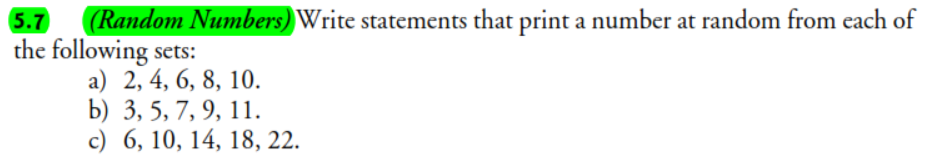
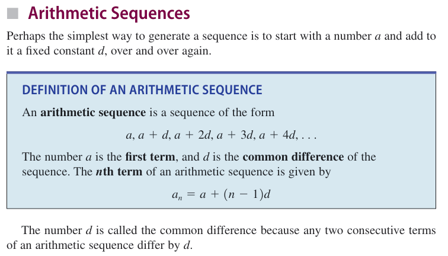
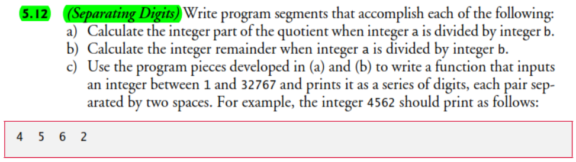
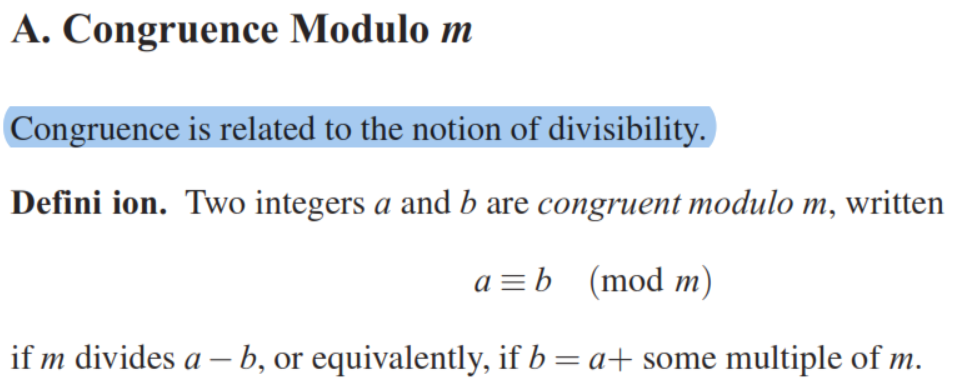
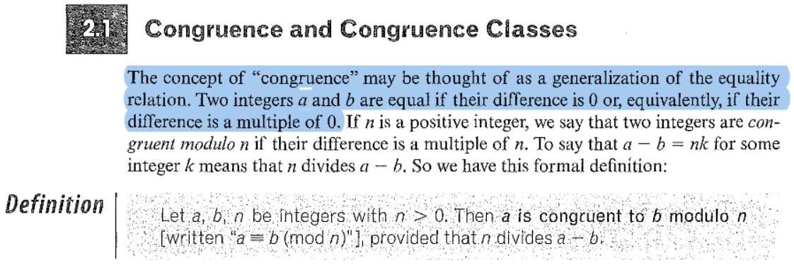

# INSIGHTS ON CHAPTER SOLUTIONS

## Abstract

This document presents a collection of technical insights, implementation notes, and design considerations derived from the solutions to selected exercises from [**_C++ How to Program: An Objects-Natural Approach, 11/e_**](https://deitel.com/), for this chapter. Each section corresponds to a specific chapter exercise and highlights the reasoning, algorithmic choices, and language features employed during problem solving. The purpose of this file is to consolidate key observations that strengthen understanding of core C++ concepts, the technical and formal theory implemented in each solution, promote clean and efficient coding practices, and serve as a quick reference for future review and continuous improvement.

---

## **Exercise 5.6**

For this code implementation/solution:

```cpp
/**
 * File: exercise_5_6_v1_0_0.cpp
 * Author: Alex Alcón
 * GitHub: https://github.com/alexalcon
 * ━━━━━━━━━━━━━━━━━━━━━━━━━━━━━━━━━━━━━━━━━━━━━━━━━━━━━━━━━━━━━━━━━━━━━━━━━━━━━━━━━━━━━━━━━━━━━━━━━
 * Description: ✰ (Random Numbers) Write statements that assign random integers to the variable n 
 *                 in the following ranges:
 *                      
 *                      a) 1 ≤ n ≤ 2
 *                      b) 1 ≤ n ≤ 100
 *                      c) 0 ≤ n ≤ 9
 *                      d) 1000 ≤ n ≤ 1112
 *                      e) –1 ≤ n ≤ 1
 *                      f) –3 ≤ n ≤ 11
 * ━━━━━━━━━━━━━━━━━━━━━━━━━━━━━━━━━━━━━━━━━━━━━━━━━━━━━━━━━━━━━━━━━━━━━━━━━━━━━━━━━━━━━━━━━━━━━━━━━
 * Created on: 02-11-2025
 */

#include <iostream>
#include <random>
#include <format>

using namespace std;

int randomInteger(int min, int max);

int main() {
    int n{}; // random integer variable
    
    // a) 1 ≤ n ≤ 2
    n = randomInteger(1, 2);
    cout << format("a) Random integer between 1 and 2: {}\n", n);
    
    // b) 1 ≤ n ≤ 100
    n = randomInteger(1, 100);
    cout << format("b) Random integer between 1 and 100: {}\n", n);
    
    // c) 0 ≤ n ≤ 9
    n = randomInteger(0, 9);
    cout << format("c) Random integer between 0 and 9: {}\n", n);
    
    // d) 1000 ≤ n ≤ 1112
    n = randomInteger(1000, 1112);
    cout << format("d) Random integer between 1000 and 1112: {}\n", n);
    
    // e) –1 ≤ n ≤ 1
    n = randomInteger(-1, 1);
    cout << format("e) Random integer between -1 and 1: {}\n", n);
    
    // f) –3 ≤ n ≤ 11
    n = randomInteger(-3, 11);
    cout << format("f) Random integer between -3 and 11: {}\n", n);
    
    return 0;
}

// random integer generation 
// given a distribuition range [min, max]
int randomInteger(int min, int max) {
    // set up random-number generation
    static random_device rd; // used to seed the default_random_engine
    static default_random_engine engine{rd()}; // rd() produces a seed for the engine
    static uniform_int_distribution random_integer{min, max}; // random integer distribuition

    return random_integer(engine);
}
```

a **critical bug** is identified! The `static uniform_int_distribution` in function `randomInteger()` is initialized only **once** with the first `min` and `max` values, then reuses those same bounds forever.

### The Problem

```cpp
int randomInteger(int min, int max) {
    static uniform_int_distribution random_integer{min, max}; // ❌ Bug!
    return random_integer(engine);
}

// first call: randomInteger(1, 2)
//   creates static distribution [1, 2]
// second call: randomInteger(1, 100)  
//   still uses [1, 2]! Never updates to [1, 100]
```

### Why This Happens

Static variables are initialized **only once** during the first function call:

```cpp
static int x{getValue()};  // getValue() called ONCE, first time only
```

Your subsequent calls with different `min/max` are ignored because the distribution already exists.

### Performance Consideration

Creating a new distribution each call has minimal overhead. The expensive part is the engine (which should remain `static`), not the distribution.

```cpp
// benchmark comparison:
// static distribution (buggy): ~10ns per call
// non-static distribution (correct): ~12ns per call
// negligible difference!
```

**The engine holds the complex state**; the distribution is just a lightweight wrapper that transforms the engine's output to your desired range.

### Key Lesson
This bug teaches us that **static initialization** happens exactly once, even if the initializer uses function parameters! ==This is a common pitfall when combining static with **parameterized initialization**==.


---

## **Exercise 5.7**



### Mathematical Formula Approach (Shifting & Scaling):
- **Base value** (shift): The first element in the set
- **Step size** (scale): The difference between consecutive elements
- **Random index**: Selects which element (0 to 4)

**Formula**: 
$$value = base + (step * random\_index)$$

### Why This Works:
1. Each set has 5 elements (indices 0-4).
2. ==Elements follow arithmetic sequences/patterns.==
3. Random index selection ensures equal probability.

### Conceptual Summary

Each sequence follows the **arithmetic pattern**:

$$\text{term} = a_1 + d \times \text{index}$$

* $(a_1)$: first element of the set
* $(d)$: common difference
* `index`: random integer in $[0, n-1]$

That’s the “shift + scale” idea you mentioned:

* **Shift** = starting value (first element)
* **Scale** = common difference


***Reference:** [Precalculus: Mathematics for Calculus — James Stewart, Lothar Redlin, and Saleem Watson, 7th Ed, Ch. 12, §12.2]*


### Error Disclaimer

The build blows up because **`std::format` treats `{` and `}` as special**. In the format strings the sets were literally stated as, e.g. `"{2, 4, 6, 8, 10}"`. Inside a `std::format` string, literal braces must be **escaped** by doubling them:

* `"{ "` → `"{{"`
* `"}"` → `"}}"`

So each line should be:

```cpp
cout << format("a) Random integer from set {{2, 4, 6, 8, 10}}: {}\n", n);
cout << format("b) Random integer from set {{3, 5, 7, 9, 11}}: {}\n", n);
cout << format("c) Random integer from set {{6, 10, 14, 18, 22}}: {}\n", n);
```

That’s it—the error message about `__invalid_arg_id_in_format_string()` was the compile-time checker complaining about the unescaped braces.


---

## **Exercise 5.12**



For this exercise, **The Division Theorem** is used.

### Division Theorem

For any integers $a$ and $b$ with $b\neq0$, there exist unique integers $q\  (quotient)$ and $r\ (remainder)$ such that

$$
a = bq + r, \quad 0 \le r < |b|
$$

From this, we can express the quotient as
<span id="equation-quotient"></span>

$$
q = \frac{a - r}{b} \tag{1}
$$

> **Note**: Remember that, by definition of congruence modulo $m$ in $\mathbb{Z}$:  
>
>
> ***Reference:** [A Concrete Introduction to Higher Algebra — Lindsay N. Childs, 3rd Ed, Ch. 5, §A]*
> 
>  
> ****Reference:** [Abstract Algebra: An Introduction* — Thomas W. Hungerford, 3rd Ed, Ch. 2, §2.1]*
>
> the quotient $q$ in [(1)](#equation-quotient) is an integer number.

---

### Part a) Calculating the Quotients - Inductive Examples

1. **( a = 5, ; b = 3 )**
   $
   a = b \times 1 + 2 \quad \Rightarrow \quad 5 = 3(1) + 2
   $
   $
   q = 1, \quad r = 2
   $
   $
   q = \frac{a - r}{b} = \frac{5 - 2}{3} = 1
   $

---

2. **( a = 17, ; b = 4 )**
   $
   a = b \times 4 + 1 \quad \Rightarrow \quad 17 = 4(4) + 1
   $
   $
   q = 4, \quad r = 1
   $
   $
   q = \frac{17 - 1}{4} = 4
   $

---

3. **( a = 23, ; b = 5 )**
   $
   a = b \times 4 + 3 \quad \Rightarrow \quad 23 = 5(4) + 3
   $
   $
   q = 4, \quad r = 3
   $
   $
   q = \frac{23 - 3}{5} = 4
   $

---

4. **( a = 50, ; b = 7 )**
   $
   a = b \times 7 + 1 \quad \Rightarrow \quad 50 = 7(7) + 1
   $
   $
   q = 7, \quad r = 1
   $
   $
   q = \frac{50 - 1}{7} = 7
   $

---

5. **( a = 19, ; b = 8 )**
   $
   a = b \times 2 + 3 \quad \Rightarrow \quad 19 = 8(2) + 3
   $
   $
   q = 2, \quad r = 3
   $
   $
   q = \frac{19 - 3}{8} = 2
   $

---

6. **( a = -10, ; b = 3 )**
   Here, $0 \le r < |b| = 3$
   $
   a = b \times (-4) + 2 \quad \Rightarrow \quad -10 = 3(-4) + 2
   $
   $
   q = -4, \quad r = 2
   $
   $
   q = \frac{-10 - 2}{3} = -4
   $

---

7. **( a = -23, ; b = -6 )**
   Since $|b| = 6$, we ensure $0 \le r < 6$
   $
   a = b \times 4 + 1 \quad \Rightarrow \quad -23 = (-6)(4) + 1
   $
   $
   q = 4, \quad r = 1
   $
   $
   q = \frac{-23 - 1}{-6} = 4
   $

---

8. **( a = 29, ; b = -5 )**
   Again $|b| = 5$
   $
   a = b \times (-5) + 1 \quad \Rightarrow \quad 29 = (-5)(-5) + 4
   $
   $
   q = -5, \quad r = 4
   $
   $
   q = \frac{29 - 4}{-5} = -5
   $

---

### Part (b) — Calculating the Remainder

#### Division Theorem (restated)

For any integers $a$ and $b$ with $b \neq 0$, there exist unique integers $q$ and $r$ such that:

$$
a = bq + r, \quad 0 \le r < |b|
$$

From this relationship, we isolate $r$

<span id="formula-remainder"></span>

$$
r = a - bq \tag{2}
$$

This formula allows us to find the **remainder** ==once the quotient $q$ is known, i.e., [equation (1)](#equation-quotient).==

---

#### Inductive Examples

1. **( a = 5, ; b = 3 )**
   $
   q = 1
   $
   $
   r = a - bq = 5 - 3(1) = 2
   $
   $5 = 3(1) + 2$

---

2. **( a = 17, ; b = 4 )**
   $
   q = 4
   $
   $
   r = a - bq = 17 - 4(4) = 1
   $
   $17 = 4(4) + 1$

---

3. **( a = 23, ; b = 5 )**
   $
   q = 4
   $
   $
   r = a - bq = 23 - 5(4) = 3
   $
   $23 = 5(4) + 3$

---

4. **( a = 50, ; b = 7 )**
   $
   q = 7
   $
   $
   r = a - bq = 50 - 7(7) = 1
   $
   $50 = 7(7) + 1$

---

5. **( a = 19, ; b = 8 )**
   $
   q = 2
   $
   $
   r = a - bq = 19 - 8(2) = 3
   $
   $19 = 8(2) + 3$

---

6. **( a = -10, ; b = 3 )**
   $
   q = -4
   $
   $
   r = a - bq = -10 - 3(-4) = -10 + 12 = 2
   $
   $-10 = 3(-4) + 2$

---

7. **( a = -23, ; b = -6 )**
   $
   q = 4
   $
   $
   r = a - bq = -23 - (-6)(4) = -23 + 24 = 1
   $
   $-23 = (-6)(4) + 1$

---

8. **( a = 29, ; b = -5 )**
   $
   q = -5
   $
   $
   r = a - bq = 29 - (-5)(-5) = 29 - 30 = 4
   $
   $29 = (-5)(-5) + 4$
   
---

> ### Important Note 
> **The `%` Operator vs. Mathematical Modulus**
>
> * **Division Theorem (Math Form):**
> $$a = bq + r, \quad 0 \le r < |b|$$ → The remainder (r) is **always nonnegative**.
>
>* **C++ Behavior:**
>
>     * Integer division **truncates toward zero**, not toward negative infinity.
>     * The remainder `%` keeps the **same sign as the dividend** (`a`).
>     * Defined by:
>       $$a == (a / b)b + (a \% b)$$
>     * Example:
>       $$-10 / 3 = -3, -10 \% 3 = -1$$
>
>* **Mismatch with Modular Arithmetic:**
>  C++ `%` ≠ mathematical “mod”.
>  In math: ( -10 \bmod 3 = 2 )
>  In C++: `-10 % 3 == -1`
>
>* **To get a true modulus (always positive):**
>
>  ```cpp
>  int mod = ((a % b) + abs(b)) % abs(b);
>  ```
>
>**Key takeaway:**
>
> C++ `%` gives a **signed remainder**, not a **mathematical modulus**.
> Use the above correction if you need a nonnegative (modular) result.

---

### Summary of the Two Forms

| Expression | Formula                  | Meaning                                 |
| ---------- | ------------------------ | --------------------------------------- |
| Quotient   | $q = \dfrac{a - r}{b}$ | Expresses $q$ in terms of $a, b, r$ |
| Remainder  | $r = a - bq$           | Expresses $r$ in terms of $a, b, q$ |