# INSIGHTS ON CHAPTER SOLUTIONS

## Abstract

This document presents a collection of technical insights, implementation notes, and design considerations derived from the solutions to selected exercises from [**_C++ How to Program: An Objects-Natural Approach, 11/e_**](https://deitel.com/c-plus-plus-how-to-program-an-objects-natural-approach-11-e/), for this chapter (chapter 5). Each section corresponds to a specific chapter exercise and highlights the inductive and/or deductive logic reasoning, algorithmic choices, and language features employed during problem solving. The purpose of this file is to consolidate key observations that strengthen understanding of core C++ concepts, the technical and formal theory implemented in each solution, promote clean and efficient coding practices (in both contexts, technical topics and framing clear documentation), and serve as a quick reference for future review and continuous improvement.

---

## **Exercise 5.6**

For this code implementation/solution:

```cpp
/**
 * File: exercise_5_6_v1_0_0.cpp
 * Author: Alex Alcón
 * GitHub: https://github.com/alexalcon
 * ━━━━━━━━━━━━━━━━━━━━━━━━━━━━━━━━━━━━━━━━━━━━━━━━━━━━━━━━━━━━━━━━━━━━━━━━━━━━━━━━━━━━━━━━━━━━━━━━━
 * Description: ✰ (Random Numbers) Write statements that assign random integers to the variable n 
 *                 in the following ranges:
 *                      
 *                      a) 1 ≤ n ≤ 2
 *                      b) 1 ≤ n ≤ 100
 *                      c) 0 ≤ n ≤ 9
 *                      d) 1000 ≤ n ≤ 1112
 *                      e) –1 ≤ n ≤ 1
 *                      f) –3 ≤ n ≤ 11
 * ━━━━━━━━━━━━━━━━━━━━━━━━━━━━━━━━━━━━━━━━━━━━━━━━━━━━━━━━━━━━━━━━━━━━━━━━━━━━━━━━━━━━━━━━━━━━━━━━━
 * Created on: 02-11-2025
 */

#include <iostream>
#include <random>
#include <format>

using namespace std;

int randomInteger(int min, int max);

int main() {
    int n{}; // random integer variable
    
    // a) 1 ≤ n ≤ 2
    n = randomInteger(1, 2);
    cout << format("a) Random integer between 1 and 2: {}\n", n);
    
    // b) 1 ≤ n ≤ 100
    n = randomInteger(1, 100);
    cout << format("b) Random integer between 1 and 100: {}\n", n);
    
    // c) 0 ≤ n ≤ 9
    n = randomInteger(0, 9);
    cout << format("c) Random integer between 0 and 9: {}\n", n);
    
    // d) 1000 ≤ n ≤ 1112
    n = randomInteger(1000, 1112);
    cout << format("d) Random integer between 1000 and 1112: {}\n", n);
    
    // e) –1 ≤ n ≤ 1
    n = randomInteger(-1, 1);
    cout << format("e) Random integer between -1 and 1: {}\n", n);
    
    // f) –3 ≤ n ≤ 11
    n = randomInteger(-3, 11);
    cout << format("f) Random integer between -3 and 11: {}\n", n);
    
    return 0;
}

// random integer generation 
// given a distribuition range [min, max]
int randomInteger(int min, int max) {
    // set up random-number generation
    static random_device rd; // used to seed the default_random_engine
    static default_random_engine engine{rd()}; // rd() produces a seed for the engine
    static uniform_int_distribution random_integer{min, max}; // random integer distribuition

    return random_integer(engine);
}
```

a **critical bug** is identified! The `static uniform_int_distribution` in function `randomInteger()` is initialized only **once** with the first `min` and `max` values, then reuses those same bounds forever.

---

### The Problem

```cpp
int randomInteger(int min, int max) {
    static uniform_int_distribution random_integer{min, max}; // ❌ Bug!
    return random_integer(engine);
}

// first call: randomInteger(1, 2)
//   creates static distribution [1, 2]
// second call: randomInteger(1, 100)  
//   still uses [1, 2]! Never updates to [1, 100]
```

---

### Why This Happens

Static variables are initialized **only once** during the first function call:

```cpp
static int x{getValue()};  // getValue() called ONCE, first time only
```

Your subsequent calls with different `min/max` are ignored because the distribution already exists.

---

### Performance Consideration

Creating a new distribution each call has minimal overhead. The expensive part is the engine (which should remain `static`), not the distribution.

```cpp
// benchmark comparison:
// static distribution (buggy): ~10ns per call
// non-static distribution (correct): ~12ns per call
// negligible difference!
```

**The engine holds the complex state**; the distribution is just a lightweight wrapper that transforms the engine's output to your desired range.

---

### Key Lesson
This bug teaches us that **static initialization** happens exactly once, even if the initializer uses function parameters! ==This is a common pitfall when combining static with **parameterized initialization**==.


---

## **Exercise 5.7**


---

### Mathematical Formula Approach (Shifting & Scaling):
- **Base value** (shift): The first element in the set
- **Step size** (scale): The difference between consecutive elements
- **Random index**: Selects which element (0 to 4)

**Formula**: 
$$value = base + (step * random\_index)$$

---

### Why This Works:
1. Each set has 5 elements (indices 0-4).
2. ==Elements follow arithmetic sequences/patterns.==
3. Random index selection ensures equal probability.

---

### Conceptual Summary

Each sequence follows the **arithmetic pattern**:

$$\text{term} = a_1 + d \times \text{index}$$

* $(a_1)$: first element of the set
* $(d)$: common difference
* `index`: random integer in $[0, n-1]$

That’s the “shift + scale” idea you mentioned:

* **Shift** = starting value (first element)
* **Scale** = common difference


***Reference:** [Precalculus: Mathematics for Calculus — James Stewart, Lothar Redlin, and Saleem Watson, 7th Ed, Ch. 12 Sequences and Series, §12.2 Arithmetic Sequences]*

---

### Error Disclaimer

The build blows up because **`std::format` treats `{` and `}` as special**. In the format strings the sets were literally stated as, e.g. `"{2, 4, 6, 8, 10}"`. Inside a `std::format` string, literal braces must be **escaped** by doubling them:

* `"{ "` → `"{{"`
* `"}"` → `"}}"`

So each line should be:

```cpp
cout << format("a) Random integer from set {{2, 4, 6, 8, 10}}: {}\n", n);
cout << format("b) Random integer from set {{3, 5, 7, 9, 11}}: {}\n", n);
cout << format("c) Random integer from set {{6, 10, 14, 18, 22}}: {}\n", n);
```

That’s it—the error message about `__invalid_arg_id_in_format_string()` was the compile-time checker complaining about the unescaped braces.


---

## **Exercise 5.12**


For this exercise, **The Division Theorem** is used.

---

### Division Theorem

For any integers $a$ and $b$ with $b\neq0$, there exist unique integers $q\  (quotient)$ and $r\ (remainder)$ such that

$$
a = bq + r, \quad 0 \le r < |b|
$$

From this, we can express the quotient as
<span id="equation-quotient"></span>

$$
q = \frac{a - r}{b} \tag{1}
$$

> **Note**: Remember that, by definition of congruence modulo $m$ in $\mathbb{Z}$:  
>
>
> ***Reference:** [A Concrete Introduction to Higher Algebra — Lindsay N. Childs, 3rd Ed, Ch. 5 Congruence, §A Congruence Modulo m]*
> 
>  
> ****Reference:** [Abstract Algebra: An Introduction* — Thomas W. Hungerford, 3rd Ed, Ch. 2 Congruence in $\mathbb{Z}$ and Modular Arithmetic, §2.1 Congruence and Congruence Classes]*
>
> the quotient $q$ in [(1)](#equation-quotient) is an integer number.

---

### Part a) Calculating the Quotients - Inductive Examples

1. **( a = 5, ; b = 3 )**
   $
   a = b \times 1 + 2 \quad \Rightarrow \quad 5 = 3(1) + 2
   $
   $
   q = 1, \quad r = 2
   $
   $
   q = \frac{a - r}{b} = \frac{5 - 2}{3} = 1
   $

---

2. **( a = 17, ; b = 4 )**
   $
   a = b \times 4 + 1 \quad \Rightarrow \quad 17 = 4(4) + 1
   $
   $
   q = 4, \quad r = 1
   $
   $
   q = \frac{17 - 1}{4} = 4
   $

---

3. **( a = 23, ; b = 5 )**
   $
   a = b \times 4 + 3 \quad \Rightarrow \quad 23 = 5(4) + 3
   $
   $
   q = 4, \quad r = 3
   $
   $
   q = \frac{23 - 3}{5} = 4
   $

---

4. **( a = 50, ; b = 7 )**
   $
   a = b \times 7 + 1 \quad \Rightarrow \quad 50 = 7(7) + 1
   $
   $
   q = 7, \quad r = 1
   $
   $
   q = \frac{50 - 1}{7} = 7
   $

---

5. **( a = 19, ; b = 8 )**
   $
   a = b \times 2 + 3 \quad \Rightarrow \quad 19 = 8(2) + 3
   $
   $
   q = 2, \quad r = 3
   $
   $
   q = \frac{19 - 3}{8} = 2
   $

---

6. **( a = -10, ; b = 3 )**
   Here, $0 \le r < |b| = 3$
   $
   a = b \times (-4) + 2 \quad \Rightarrow \quad -10 = 3(-4) + 2
   $
   $
   q = -4, \quad r = 2
   $
   $
   q = \frac{-10 - 2}{3} = -4
   $

---

7. **( a = -23, ; b = -6 )**
   Since $|b| = 6$, we ensure $0 \le r < 6$
   $
   a = b \times 4 + 1 \quad \Rightarrow \quad -23 = (-6)(4) + 1
   $
   $
   q = 4, \quad r = 1
   $
   $
   q = \frac{-23 - 1}{-6} = 4
   $

---

8. **( a = 29, ; b = -5 )**
   Again $|b| = 5$
   $
   a = b \times (-5) + 1 \quad \Rightarrow \quad 29 = (-5)(-5) + 4
   $
   $
   q = -5, \quad r = 4
   $
   $
   q = \frac{29 - 4}{-5} = -5
   $

---

### Part (b) — Calculating the Remainder

#### Division Theorem (restated)

For any integers $a$ and $b$ with $b \neq 0$, there exist unique integers $q$ and $r$ such that:

$$
a = bq + r, \quad 0 \le r < |b|
$$

From this relationship, we isolate $r$

<span id="formula-remainder"></span>

$$
r = a - bq \tag{2}
$$

This formula allows us to find the **remainder** ==once the quotient $q$ is known, i.e., [equation (1)](#equation-quotient).==

---

#### Inductive Examples

1. **( a = 5, ; b = 3 )**
   $
   q = 1
   $
   $
   r = a - bq = 5 - 3(1) = 2
   $
   $5 = 3(1) + 2$

---

2. **( a = 17, ; b = 4 )**
   $
   q = 4
   $
   $
   r = a - bq = 17 - 4(4) = 1
   $
   $17 = 4(4) + 1$

---

3. **( a = 23, ; b = 5 )**
   $
   q = 4
   $
   $
   r = a - bq = 23 - 5(4) = 3
   $
   $23 = 5(4) + 3$

---

4. **( a = 50, ; b = 7 )**
   $
   q = 7
   $
   $
   r = a - bq = 50 - 7(7) = 1
   $
   $50 = 7(7) + 1$

---

5. **( a = 19, ; b = 8 )**
   $
   q = 2
   $
   $
   r = a - bq = 19 - 8(2) = 3
   $
   $19 = 8(2) + 3$

---

6. **( a = -10, ; b = 3 )**
   $
   q = -4
   $
   $
   r = a - bq = -10 - 3(-4) = -10 + 12 = 2
   $
   $-10 = 3(-4) + 2$

---

7. **( a = -23, ; b = -6 )**
   $
   q = 4
   $
   $
   r = a - bq = -23 - (-6)(4) = -23 + 24 = 1
   $
   $-23 = (-6)(4) + 1$

---

8. **( a = 29, ; b = -5 )**
   $
   q = -5
   $
   $
   r = a - bq = 29 - (-5)(-5) = 29 - 30 = 4
   $
   $29 = (-5)(-5) + 4$
   
---

> ### Important Note 
> **The `%` Operator vs. Mathematical Modulus**
>
> * **Division Theorem (Math Form):**
> $$a = bq + r, \quad 0 \le r < |b|$$ → The remainder (r) is **always nonnegative**.
>
>* **C++ Behavior:**
>
>     * Integer division **truncates toward zero**, not toward negative infinity.
>     * The remainder `%` keeps the **same sign as the dividend** ($a$).
>     * Defined by:
>       $$a == (a / b)b + (a \% b)$$
>     * Example:
>       $$-10 / 3 = -3, -10 \% 3 = -1$$
>
>* **Mismatch with Modular Arithmetic:**
>  C++ `%` ≠ mathematical “mod”.
>  In math: ($-10 \bmod 3 = 2$)
>  In C++: `-10 % 3 == -1`
>
>* **To get a true modulus (always positive):**
>
>  ```cpp
>  int mod = ((a % b) + abs(b)) % abs(b);
>  ```
>
>**Key takeaway:**
>
> C++ `%` gives a **signed remainder**, not a **mathematical modulus**. Use the above correction if you need a nonnegative (modular) result.

---

### Summary of the Two Forms

| Expression | Formula                  | Meaning                                 |
| ---------- | ------------------------ | --------------------------------------- |
| Quotient   | $q = \dfrac{a - r}{b}$ | Expresses $q$ in terms of $a, b, r$ |
| Remainder  | $r = a - bq$           | Expresses $r$ in terms of $a, b, q$ |

--- 

## **Exercise 5.16**

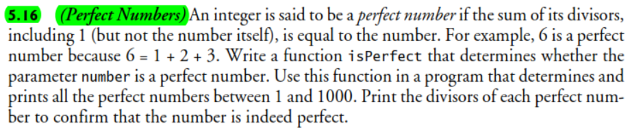

---

### Divisors never exceed half of a number (except the number itself)

Why divisors never exceed half of a number (except the number itself) connects arithmetic reasoning with algorithmic optimization?

---

#### Step 1: Recall the definition of a divisor

An integer $d$ is a **divisor** of  $n$ if and only if

$$
n = d \times q
$$

for some integer $q$.

That means: $d$ divides $n$ **exactly**, leaving no remainder.

---

#### Step 2: Rewriting the divisor condition

If $d$ divides $n$, then

$$
q = \frac{n}{d}
$$

and both $d$ and $q$ are positive integers satisfying
$$
1 \le d \le n, \quad 1 \le q \le n
$$
and together they form a **factor pair** $(d, q)$.

For example, for $n = 12$:
$$
12 = 1\times12 = 2\times6 = 3\times4
$$
So the **factor pairs** are:
$$
(1,12),\ (2,6),\ (3,4)
$$

---

#### Proof: Understanding Why $1 \le d \le n$ and $1 \le q \le n$

##### 1. Definition of Divisibility

For any two integers $a, b$, we say that:

> $a$ **divides** $b$ (written $a \mid b$) if and only if there exists an integer $k$ such that

$$
b = a \times k
$$

In this relation:

* $a$ is a **divisor** of $b$
* $b$ is a **multiple** of $a$
* $k$ is the **quotient**

**Example:**
$$
12 = 3 \times 4 \quad \Rightarrow \quad 3 \mid 12
$$

##### 2. Restricting to Positive Integers

When we study *divisors* or *perfect numbers*, we work in the **positive integer domain**:

$$
a, b, k \in \mathbb{N}, \quad b > 0
$$

Replacing variables with standard notation for divisors:

$$
n = d \times q
$$

Where:

* $n$: the number being analyzed
* $d$: a divisor of $n$
* $q$: the corresponding quotient

##### 3. Determining the Range of Possible Values

Both $d$ and $q$ are **positive integers** that satisfy $n = d \times q$.
We’ll now find their **minimum** and **maximum** values.

###### (a) Minimum Possible Divisor

The smallest possible divisor of $n$ is **1**, since:

$$
n = 1 \times n
$$

Hence:

$$
d_{\min} = 1, \quad q_{\max} = n
$$

###### (b) Maximum Possible Divisor

The largest possible divisor is the number itself:

$$
n = n \times 1
$$

So:

$$
d_{\max} = n, \quad q_{\min} = 1
$$

##### 4. Therefore, the Ranges Are

$$
1 \le d \le n, \quad 1 \le q \le n
$$

Each valid pair $(d, q)$ satisfies:

$$
n = d \times q
$$

and divisors always appear in **pairs** $(d, q)$ that multiply to $n$.

##### 5. Symmetry Between ( d ) and ( q )

Since $n = d \times q$ implies $n = q \times d$, the relationship is **symmetric**.
Thus, if $d$ is small, $q$ is large — and vice versa.

| $d$ | $q = n/d$ | Product |
| :-: | :-------: | :-----: |
|  1  |     12    |    12   |
|  2  |     6     |    12   |
|  3  |     4     |    12   |
|  4  |     3     |    12   |
|  6  |     2     |    12   |
|  12 |     1     |    12   |

##### 6. Why No Proper Divisor Exceeds ( n/2 )

If $d > \frac{n}{2}$, then:

$$
2d > n
$$

meaning $d$ multiplied by any integer $\ge 2$ will exceed $n$.
The only integer $q$ satisfying $d \times q = n$ would be $q = 1$,
which gives $d = n$.

Hence, **no proper divisor** (excluding $n$ itself) can exceed $n/2$.

##### 7. Summary

| Concept              | Statement                                    |
| :------------------- | :------------------------------------------- |
| Divisibility         | $n = d \times q$ for integers ( d, q > 0 ) |
| Always true          | $1 \le d, q \le n$                         |
| Smallest pair        | $(1, n)$                                   |
| Largest pair         | $(n, 1)$                                   |
| Proper divisor range | $1 \le d \le \frac{n}{2}$                  |
| Beyond ( n/2 )       | Only $d = n$ (since $q = 1$)             |

##### 8. Intuitive Visualization

```
n = d × q

↓   ↓
small large
large small
```

**Factor pairs example:**
$$
(1, n),\ (2, n/2),\ (3, n/3), \dots, (\sqrt{n}, \sqrt{n}), \dots, (n, 1)
$$

As soon as $d > n/2$,
the quotient becomes $q < 2 \Rightarrow q = 1$, leaving only $d = n$ as a valid case.

---

#### Step 3: Understanding the “half” boundary

Notice something:

* In each factor pair, one element is **less than or equal to $\sqrt{n}$**,
* and the other is **greater than or equal to $\sqrt{n}$**.

Now, if we focus only on **divisors smaller than the number itself**,
that means we exclude $d = n$.

So the largest possible divisor less than $n$ must satisfy:

$$
d \times 2 \le n
$$
i.e.
$$
d \le \frac{n}{2}
$$

**Why is that true?**

Suppose $d > \frac{n}{2}$.
Then multiply both sides by 2:

$$
2d > n
$$

This implies $d \times 2 > n$,
which means there’s **no integer $q \ge 2$** satisfying $d \times q = n$.

The only possible integer $q$ that could make $d \times q = n$ true is $q = 1$.
That would give $d = n$.

Hence:

* if $d > n/2$, the only multiple of $d$ less than or equal to $n$ is $d \times 1 = d = n$.
* Therefore, **no proper divisor** (excluding $n$ itself) can be greater than $n/2$.

---

#### Step 4: Example verification

Take $n = 20$:

| $d$  | $20 / d$ | Is divisor?      |
| ----- | -------- | ---------------- |
| 1     | 20       | ✅                |
| 2     | 10       | ✅                |
| 3     | 6.66     | ❌                |
| 4     | 5        | ✅                |
| 5     | 4        | ✅                |
| 6     | 3.33     | ❌                |
| 7     | 2.85     | ❌                |
| 8     | 2.5      | ❌                |
| 9     | 2.22     | ❌                |
| 10    | 2        | ✅                |
| 11–19 | < 2      | ❌                |
| 20    | 1        | ✅ (but excluded) |

→ The largest *proper divisor* is $10 = n/2$.
→ None beyond $n/2$ divide $n$.

---

#### Step 5: Algorithmic insight

This is why in the loop we can safely write:

```cpp
for (int divisor = 1; divisor <= number / 2; ++divisor)
```

Because:

* Any divisor greater than $number / 2$ would require a quotient $q < 2$,
* which implies $q = 1 \Rightarrow divisor = number$,
* and that’s excluded when checking *proper divisors* (since we don’t include the number itself).

---

#### Summary Note

> A positive integer $d$ divides $n$ if $n = dq$ for some integer $q$.
> If $d > n/2$, then $q < 2$, meaning $q = 1$ and $d = n$.
> Therefore, no **proper divisor** of $n$ can exceed $n/2$.

That’s why in the perfect-number algorithm, you only need to test divisors up to $n/2$ — it’s mathematically complete and computationally efficient.

---

## **Exercise 5.17**

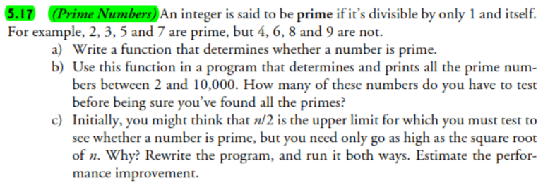

The mathematical theory background that answers the question stated in `part c)`, can be studied in this theorem: 

> 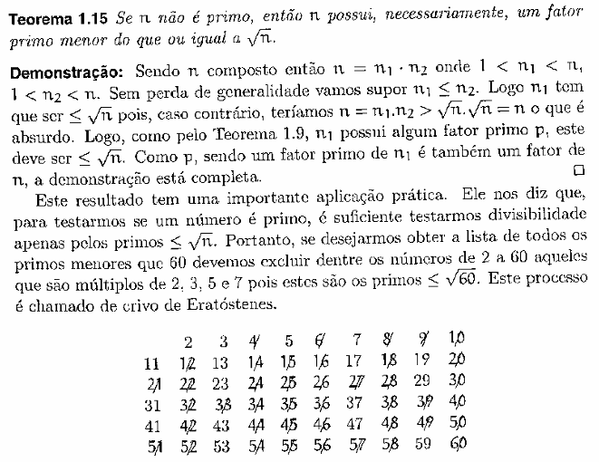
> 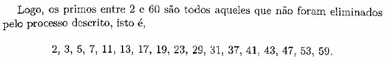
> ***Reference:** [Introdução à Teoria dos Números — José Plínio de Oliveira Santos, Ch. 1 Divisibilidade, §1.6 Números Primos]*

---

## **Exercise 5.19**

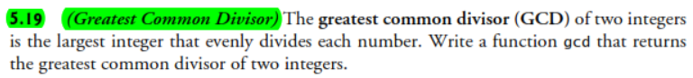

The mathematical theory background to understand **Euclid's Algorithm** can be studied in the following resource:

> 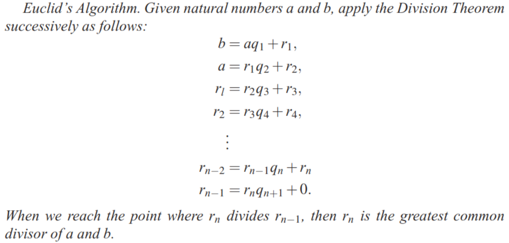
> ***Reference:** [A Concrete Introduction to Higher Algebra — Lindsay N. Childs, 3rd Ed, Ch. 3 Euclid’s Algorithm, §C Euclid’s Algorithm] - It is recomended to read the whole chapter in order to understand deeply the algorithm.*

---

## **Exercise 5.23**


---

### Why 10 Guesses Are Enough (First-Principles Intuition)

**Idea**: if the player always guesses **smartly**, each guess can **eliminate about half** the remaining possibilities — like a binary search.

1. Initially, the number is in the range ($[1, 1000]$), so there are 1000 possibilities.
2. After one well-chosen guess (e.g., the middle), the response “Too high” or “Too low” cuts the range roughly in half:

   * from 1000 → about 500 possible numbers left.
3. Repeating this halving:

   * $After\ 1st\ guess ≤ 500\ possibilities$
   * $2nd:\ ≤ 250$
   * $3rd:\ ≤ 125$
   * $4th:\ ≤ 62$
   * $5th:\ ≤ 31$
   * $6th:\ ≤ 16$
   * $7th:\ ≤ 8$
   * $8th:\ ≤ 4$
   * $9th:\ ≤ 2$
   * $10th:\ ≤ 1$  (you’ve pinned down the exact number)

Mathematically, after $(k)$ optimal guesses, the maximum remaining possibilities are about:

$$
\frac{1000}{2^k}
$$

We want:

$$
\frac{1000}{2^k} \le 1
\quad \Rightarrow \quad
2^k \ge 1000
$$

Now:

* $(2^9 = 512)$
* $(2^{10} = 1024 \ge 1000)$

So $(k = 10)$ guesses is enough to reduce the possibilities to **1 number**, meaning **any number from 1 to 1000 can be found in at most 10 optimal guesses**.

---

## **Exercise 5.24**

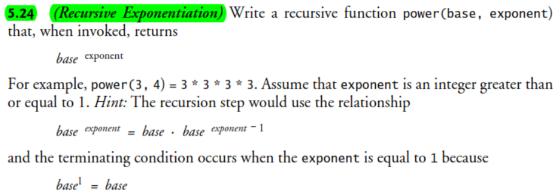

---

According to this definition: 

>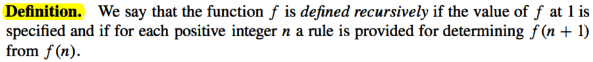
> ***Reference:** [Elementary Number Theory and its Applications — Kenneth H. Rosen, 6th Ed, Ch. 1 The Integers, §1.3 Mathematical Induction]*

Let  

$$
f(n)=b^{n}, \qquad n\in \mathbb{N},\; b\in\mathbb{Z}
$$

Then  

$$
f(n+1)=b^{n+1}=b^{n}\cdot b^{1}
$$

Base case:

$$
f(1)=b^{1}
$$

Recursive rule:

$$
f(n)=b^{\,n-1}\cdot b^{1}
$$

---

## **Exercise 5.26**

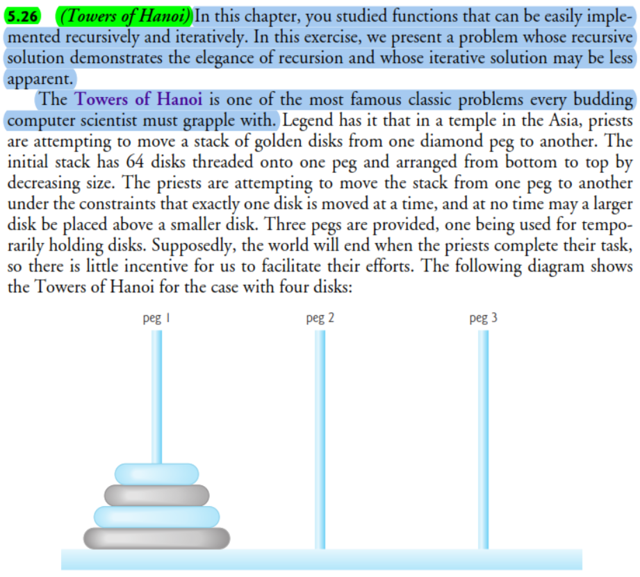
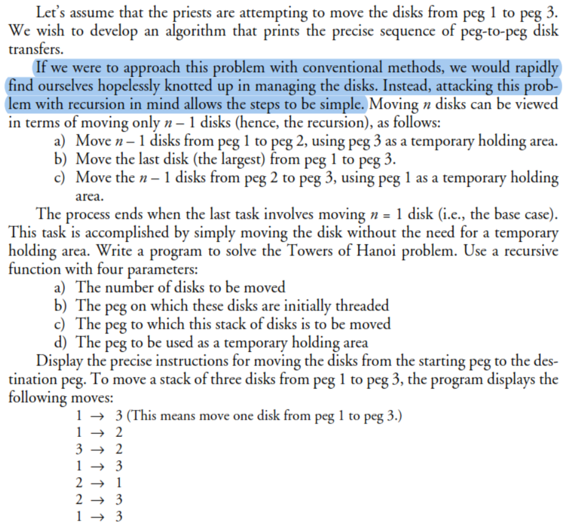

--- 

For a reference idea on how the recursive idea of this algorithm can be analyzed consider the following problem:

> 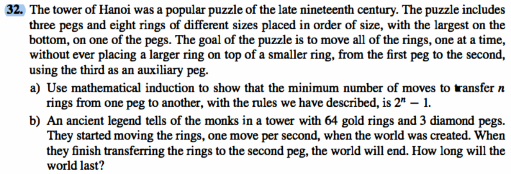
>
> ***Reference:** [Elementary Number Theory and its Applications — Kenneth H. Rosen, 6th Ed, Ch. 1 The Integers, §1.3 Mathematical Induction (Exercises section)]*

### Proof: Minimum Moves for the Towers of Hanoi is \(2^n - 1\)

Let \(T(n)\) denote the minimum number of moves needed to transfer \(n\) rings from one peg to another, following the rules of the Tower of Hanoi.

We want to prove:

$$
T(n) = 2^n - 1.
$$

---

#### Base Case: \(n = 1\)

For one ring, the only legal move is to transfer it directly to the target peg.

Thus:

$$
T(1) = 1.
$$

And the formula gives:

$$
2^1 - 1 = 1.
$$

So the base case holds.

---

#### Induction Step

**Induction Hypothesis:**  
Assume that for some integer \(k \ge 1\),

$$
T(k) = 2^k - 1.
$$

We must prove:

$$
T(k+1) = 2^{k+1} - 1.
$$

---

#### Step 1: Move \(k\) rings out of the way

To move the largest ring (the \((k+1)\)-th ring), the smaller \(k\) rings must be moved from peg A to peg C.

By the induction hypothesis, this takes:

$$
T(k) = 2^k - 1 \quad \text{moves}.
$$

---

#### Step 2: Move the largest ring

Move the \((k+1)\)-th ring from peg A to peg B:

$$
1 \quad \text{move}.
$$

---

#### Step 3: Move the \(k\) rings onto the largest ring

Move the \(k\) rings from peg C to peg B.  
By the induction hypothesis:

$$
T(k) = 2^k - 1.
$$

---

#### Compute the total:

\[
\begin{aligned}
T(k+1)
&= (2^k - 1) + 1 + (2^k - 1) \\
&= 2^{k+1} - 1.
\end{aligned}
\]

Thus:

$$
T(k+1) = 2^{k+1} - 1.
$$

---

#### Conclusion

By mathematical induction, for all \(n \ge 1\):

$$
\boxed{T(n) = 2^n - 1}.
$$

---

### Part (b): How long will the world last?

For \(n = 64\):

$$
T(64) = 2^{64} - 1 = 18\,446\,744\,073\,709\,551\,615.
$$

At one move per second:

$$
\text{years} \approx 
\frac{2^{64}-1}{31\,536\,000}
\approx 5.85 \times 10^{11}.
$$

So the legend predicts:

$$
\boxed{\text{The world ends in about } 585 \text{ billion years.}}
$$

---

> To explore a **visual, step-by-step depiction** of the recursive solution implemented in
> `exercise_5_26_v1_0_0.cpp`, refer to the interactive HTML file located at:
> `./ch05/towers_of_hanoi_recursion_visualization.html`.
>
> You can view the visualization by opening the file directly in your browser (i.e., using your browser app), or by serving it locally using the **Live Server** extension for VS Code:
> [https://marketplace.visualstudio.com/items?itemName=ritwickdey.LiveServer](https://marketplace.visualstudio.com/items?itemName=ritwickdey.LiveServer)

---